# Project 12 - Ansible Refactoring, Assignments & Imports


---

## Jenkins Enhancement
  ### On Jenkins-Ansible Server
- To enhance the experience and avoid the challenges of working with multiple directories created by Jenkins build, create new directory in home directory for Jenkins to save the ansible artifacts. Name it `ansible-config-artifact`
  ```
  mkdir ansible-config-artifact
  ```
- Change permissions of `ansible-config-artifact` to allow Jenkins operate on it
  ```
  sudo chmod -R 0777 /home/ubuntu/ansible-config-artifact
  ```
- Install `Copy Artifact` plugin. Dashboard -> Manage Plugins -> Goto `Available` tab -> Search for plugin -> Click `Install without restart`.
  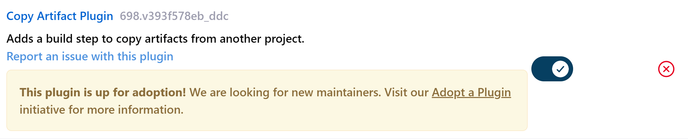
- Create new freestyle project `save_artifacts` and Configure trigger to build after `ansible` project build
  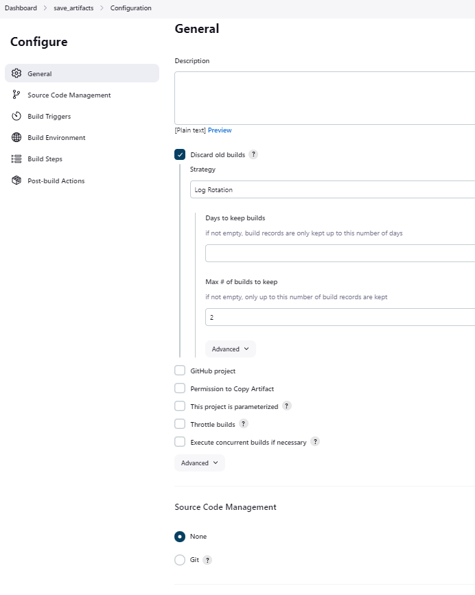
  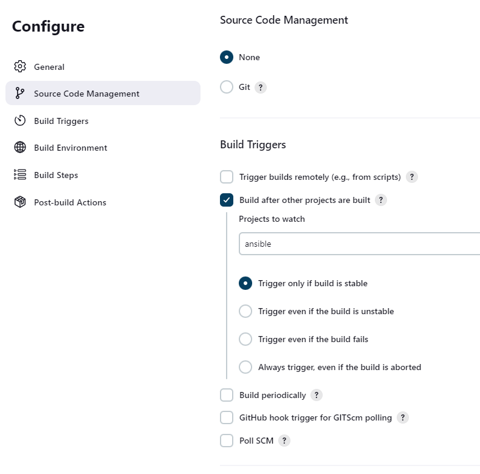
- Configure to copy artifact to `/home/ubuntu/ansible-config-artifact`
  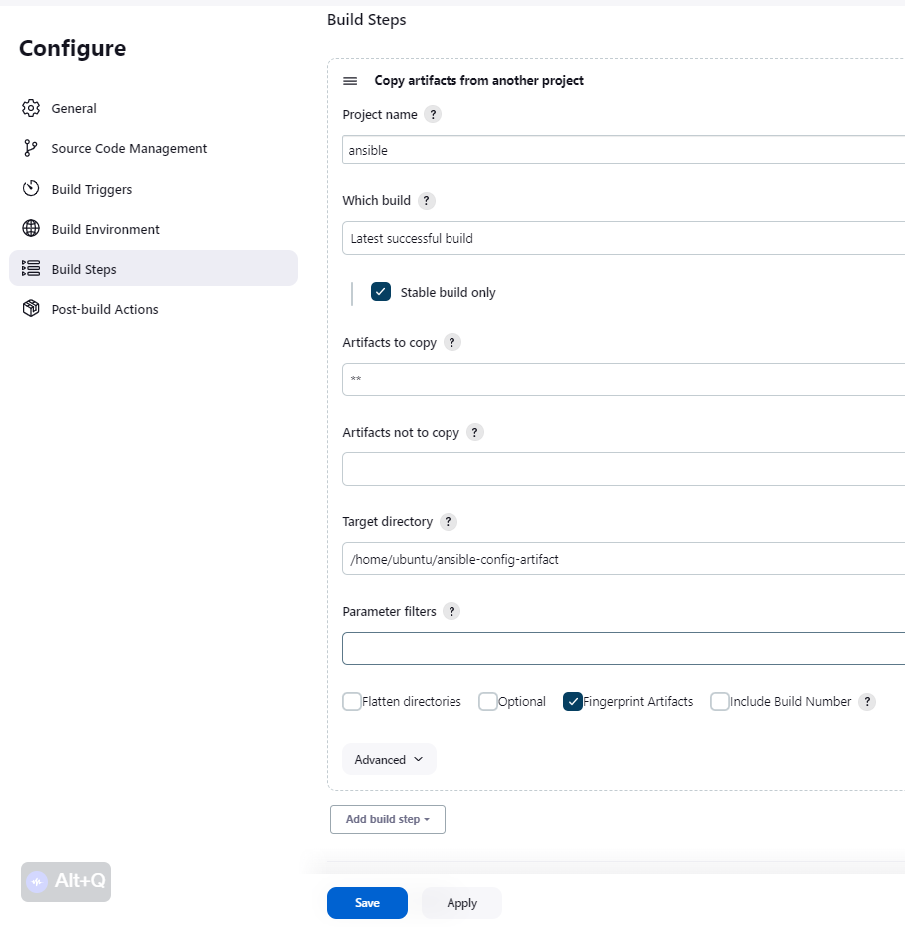
- Test setup by making a git commit and push to github to trigger Jenkins build pipeline.
  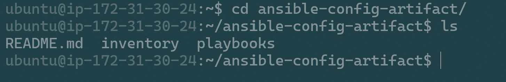
## Ansible Code Refactoring
  ### On Developer's PC
- Create and switch to new git branch called `refactor`
  ```
  git checkout -b refactor
  ```
- Create `site.yml` within `playbooks` directory. This will be the new entry point for the entire configuration as we break out tasks and plays into separate smaller files.
- Create a folder called `static-assignments` in the root directory to holder all other child playbooks.
- Move `common.yml` to `static-assignments` folder
- Edit `site.yml` and import `common.yml` playbook:
  ```yml
  ---
  - hosts: all
  - import_playbook: ../static-assignments/common.yml
  ```
- Run ansible playbook under dev environment: 
  ```yml
  ansible-playbook -i inventory/dev.yml playbooks/site.yml
  ```
## Use Ansible Roles to Configure UAT Webservers
- Launch 2 EC2 instances with RHEL 8.6.0 image. Name them `Web1-UAT` and `Web2-UAT`
- Create- and navigate into- directory called `roles` in project root.
- To automatically create required roles directory structure, run `ansible-galaxy init <role-name>` in terminal
- Delete folders not required for the project such as `tests`, `files`, and `vars`. Folder structure should look like this:
  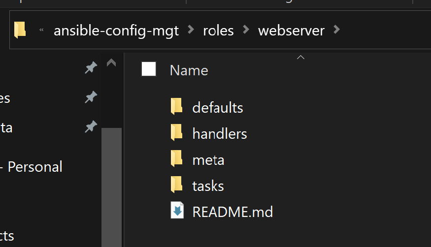
- Update UAT environment inventory file `inventory/uat.yml` with the private IP addresses of the target servers.
  ```yml
  [uat-webservers]
  <Web1-UAT-Private-IP> ansible_ssh_user='ec2-user'
  <Web2-UAT-Private-IP> ansible_ssh_user='ec2-user'
  ```
- Configure the tasks Ansible should execute on target servers by defining them in `webserver/tasks/main.yml`. In this scenerios we want Ansible to: 
  - Install and configure Apache (http service)
  - Clone `https://github.com/mrdankuta/pbl7-tooling.git`
  - Deploy cloned repo to `/var/www/html` on both UAT webservers
  - Ensure `httpd` service is started.
  ```yml
  ---
  # tasks file for webserver
  - name: install apache
    become: true
    ansible.builtin.yum:
      name: "httpd"
      state: present

  - name: install git
    become: true
    ansible.builtin.yum:
      name: "git"
      state: present

  - name: clone a repo
    become: true
    ansible.builtin.git:
      repo: https://github.com/mrdankuta/pbl7-tooling.git
      dest: /var/www/html
      force: yes

  - name: copy html content to one level up
    become: true
    command: cp -r /var/www/html/html/ /var/www/

  - name: Start service httpd, if not started
    become: true
    ansible.builtin.service:
      name: httpd
      state: started

  - name: recursively remove /var/www/html/html/ directory
    become: true
    ansible.builtin.file:
      path: /var/www/html/html
      state: absent
  ```
- Create assignment in `static-assignments` directory and reference `webserver` role in `static-assignments/uat-webservers.yml`
  ```yml
  ---
  - hosts: uat-webservers
    roles:
      - webserver
  ```
- Edit entry point file `site.yml` and import `uat-webservers.yml` assignment:
  ```yml
  ---
  - hosts: all
  - import_playbook: ../static-assignments/common.yml

  - hosts: uat-webservers
  - import_playbook: ../static-assignments/uat-webservers.yml
  ```

## Commit & Run
- Commit code 
  ```
  git commit -m "message"
  ```
- Push to `refactor` branch 
  ```
  git push
  ```
- In github, create Pull Request.
  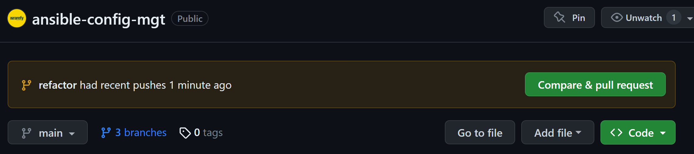
- Checkout to main/master branch 
  ```
  git checkout main
  ```
- Merge code on `refactor` branch to `main` 
  ```
  git merge refactor
  ```
- This should trigger the `ansible` pipeline on Jenkins and subsequently trigger the `save-artifact` pipeline. Which is meant to copy the artifact (all we've done above) to `/home/ubuntu/ansible-config-artifact` and should look like this:
  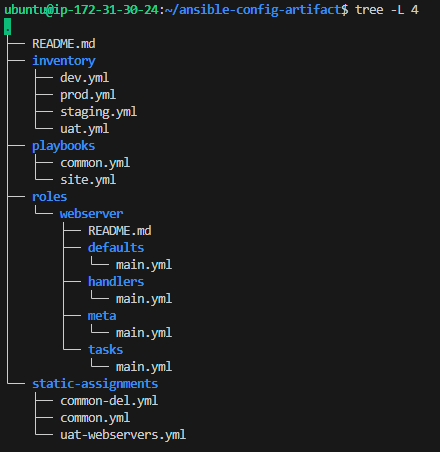
- SSH into the Jenkins-Ansible server
  ```
  eval `ssh-agent -s`
  ssh-add <path/to/private/key>
  ssh -A ubuntu@<jenkins-ansible-ip>
  ```
- Ping Ansible target servers to be sure Ansible can connect
  ```
  ansible all -m ping
  ```
  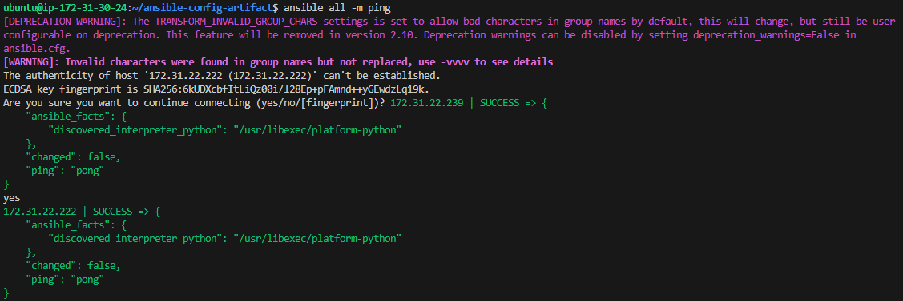
- Setup Ansible to know where to find the roles you configure by editing `/etc/ansible/ansible.cfg` and uncommenting `roles_path    = /home/ubuntu/ansible-config-artifact/roles`. Add the line, if not found. Use `/<search-term>` to search in `VI Editor`
  ```
  sudo vi /etc/ansible/ansible.cfg
  ```
- With all these in place, run the Ansible playbook
  ```
  ansible-playbook -i inventory/uat.yml playbooks/site.yml
  ```
  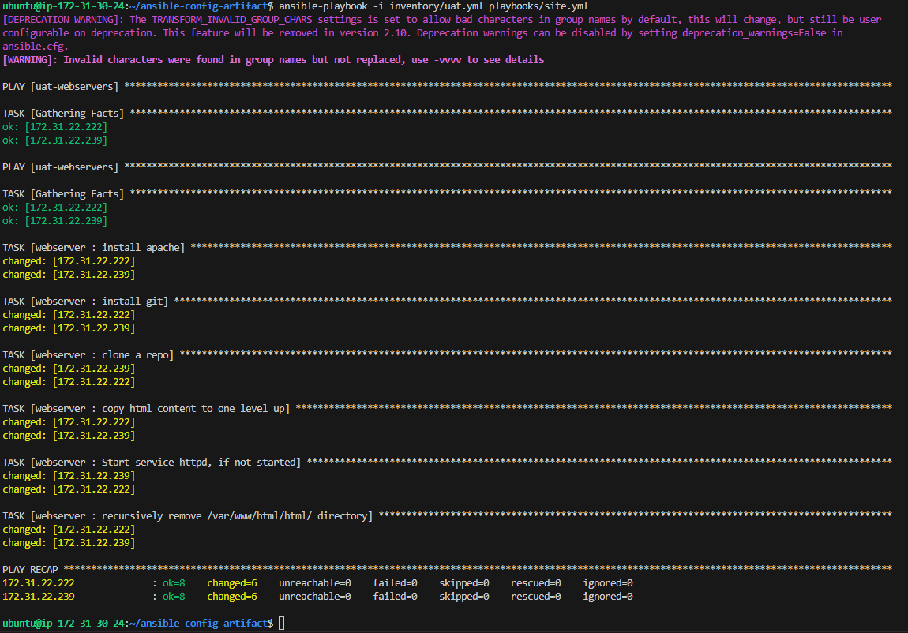
- Check that Ansible executed all tasks adequately by opening up `http port` for webservers in EC2 and visit `<Web1-UAT-public-ip>/index.php` and `<Web2-UAT-public-ip>/index.php`
  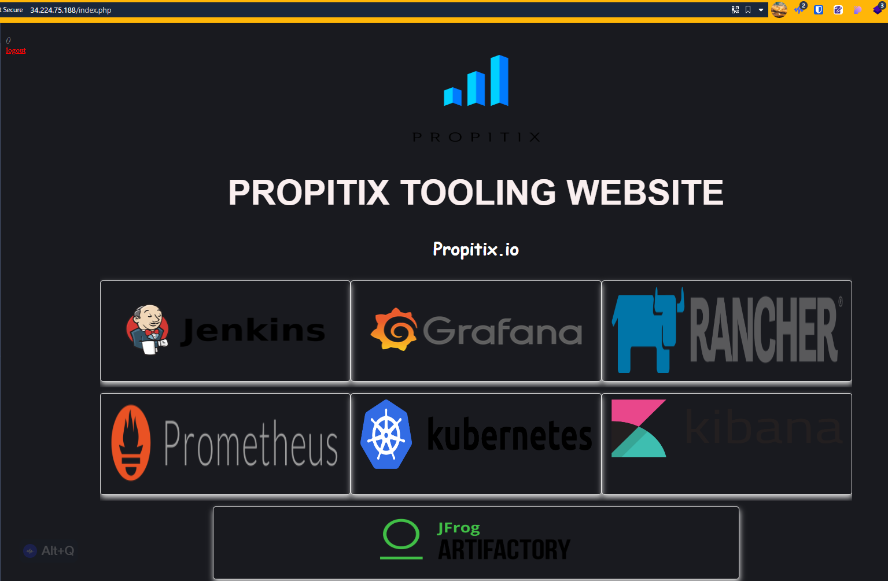
  